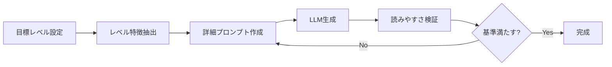
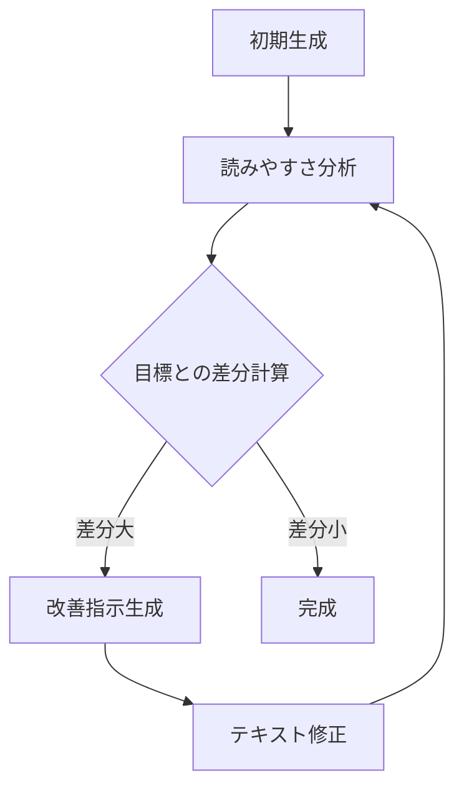
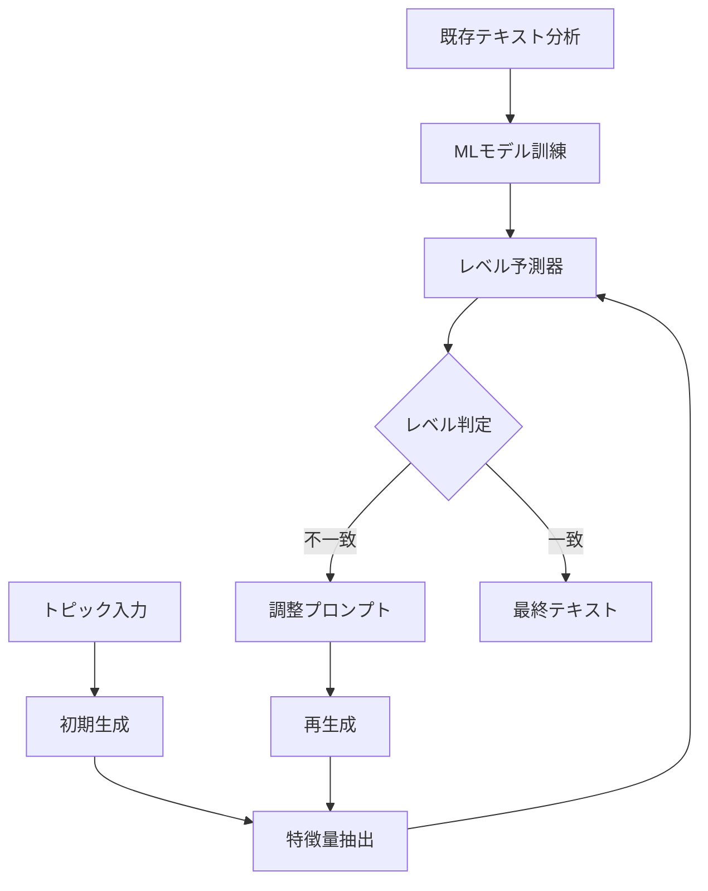

# 英文読みやすさレベル指定テキスト生成システム - 実装ガイド

## 📊 現状分析

あなたのデータセット：
- **30個のテキストファイル** (Text_1.txt ~ Text_30.txt)
- **8つの読みやすさ指標**：
  - AvrDiff: 平均難易度
  - BperA: 文章の複雑さ
  - CVV1: 語彙の多様性
  - AvrFreqRank: 平均頻度ランク
  - ARI: Automated Readability Index
  - VperSent: 文あたりの動詞数
  - POStypes: 品詞タイプ数
  - LenNP: 名詞句の長さ
- **9つのCEFRレベル**: A1.1, A1.2, A2.2, B1.1, B1.2, B2.1, B2.2, C1, C2

## 🎯 実現可能な4つのアプローチ

### アプローチ1: プロンプトエンジニアリング主導型
**概要**: LLM（GPT-4等）に詳細な制約を与えて生成



**メリット**:
- 実装が比較的簡単
- 自然な文章生成
- トピックの柔軟性が高い

**デメリット**:
- API利用コストがかかる
- 厳密な制御が難しい
- 再現性に課題

**実装ステップ**:
```python
# ステップ1: レベルプロファイルの作成
level_profiles = {
    'A1.1': {
        'sentence_length': (3, 8),
        'vocabulary_size': 500,
        'grammar': ['present simple'],
        'topics': ['daily life', 'family', 'basic needs']
    },
    # 他のレベルも同様に定義
}

# ステップ2: プロンプト生成
def create_prompt(level, topic, word_count):
    profile = level_profiles[level]
    prompt = f"""
    Generate a {word_count}-word English text about "{topic}".
    
    Requirements for {level} level:
    - Sentence length: {profile['sentence_length'][0]}-{profile['sentence_length'][1]} words
    - Use only: {', '.join(profile['grammar'])}
    - Vocabulary: top {profile['vocabulary_size']} most common words
    - Style: Simple, clear, concrete examples
    
    Text:
    """
    return prompt
```

### アプローチ2: 反復改善型
**概要**: 生成と評価を繰り返して目標レベルに収束



**メリット**:
- 精度の高い制御が可能
- 学習データとの一致度が高い
- 改善過程が追跡可能

**デメリット**:
- 処理時間が長い
- 複数回のAPI呼び出しが必要
- 複雑な実装

**実装例**:
```python
def iterative_generation(target_level, topic, max_iterations=5):
    text = initial_generation(topic)
    
    for i in range(max_iterations):
        metrics = calculate_metrics(text)
        distance = calculate_distance(metrics, target_level)
        
        if distance < threshold:
            break
            
        adjustments = determine_adjustments(metrics, target_level)
        text = apply_adjustments(text, adjustments)
    
    return text
```

### アプローチ3: ハイブリッド型（推奨）
**概要**: 機械学習モデルとLLMを組み合わせた生成



**実装フロー**:

```python
# ステップ1: 既存データから学習
import pandas as pd
from sklearn.ensemble import RandomForestClassifier
import textstat

# データ準備
df = pd.read_excel('readability_data.xlsx')
texts = load_text_files()  # Text_1.txt ~ Text_30.txt を読み込み

# 特徴量抽出関数
def extract_features(text):
    return {
        'ari': textstat.automated_readability_index(text),
        'fre': textstat.flesch_reading_ease(text),
        'word_count': len(text.split()),
        'avg_sentence_length': textstat.avg_sentence_length(text),
        # 他の特徴量も追加
    }

# モデル訓練
features = [extract_features(text) for text in texts]
model = RandomForestClassifier()
model.fit(features, df['predict_level'])

# ステップ2: 生成と検証のループ
def generate_validated_text(target_level, topic):
    attempts = 0
    while attempts < 10:
        # LLMで生成
        text = llm_generate(target_level, topic)
        
        # レベル予測
        features = extract_features(text)
        predicted_level = model.predict([features])[0]
        
        if predicted_level == target_level:
            return text
        
        # フィードバックを作成
        feedback = create_feedback(features, target_level)
        attempts += 1
    
    return text  # 最後の試行を返す
```

### アプローチ4: テンプレート拡張型
**概要**: レベル別テンプレートをLLMで拡張

**メリット**:
- 確実なレベル制御
- 低コスト
- 教育用途に最適

**実装例**:
```python
class TemplateExpander:
    def __init__(self):
        self.templates = {
            'A1.1': [
                "{subject} {be} {adjective}.",
                "{subject} {have} {object}.",
                "{subject} {action} every day."
            ],
            'B1.1': [
                "Although {clause1}, {clause2}.",
                "If {condition}, {result}.",
                "{subject} {past_action} because {reason}."
            ]
        }
    
    def expand_with_llm(self, level, topic):
        template = random.choice(self.templates[level])
        
        # LLMでスロットを埋める
        prompt = f"""
        Fill in this template about {topic}:
        Template: {template}
        Use vocabulary appropriate for {level} level.
        """
        
        filled = llm_complete(prompt)
        return filled
```

## 🛠️ 実装に必要なツールとライブラリ

### 必須ライブラリ
```bash
# 基本的な処理
pip install pandas numpy openpyxl

# テキスト分析
pip install textstat
pip install spacy
python -m spacy download en_core_web_sm
pip install nltk

# 機械学習
pip install scikit-learn

# LLM連携
pip install openai  # OpenAI API使用の場合
pip install anthropic  # Claude API使用の場合
pip install transformers  # ローカルLLM使用の場合
```

### 読みやすさ指標の計算
```python
import textstat
import spacy
from collections import Counter

nlp = spacy.load("en_core_web_sm")

def calculate_readability_metrics(text):
    doc = nlp(text)
    
    # 基本指標
    ari = textstat.automated_readability_index(text)
    
    # 語彙の多様性 (CVV1)
    tokens = [token.text.lower() for token in doc if token.is_alpha]
    cvv1 = len(set(tokens)) / len(tokens) if tokens else 0
    
    # 文あたりの動詞数
    verbs = [token for token in doc if token.pos_ == "VERB"]
    sentences = list(doc.sents)
    v_per_sent = len(verbs) / len(sentences) if sentences else 0
    
    # 名詞句の平均長
    noun_phrases = [chunk for chunk in doc.noun_chunks]
    avg_np_length = sum(len(np.text.split()) for np in noun_phrases) / len(noun_phrases) if noun_phrases else 0
    
    return {
        'ARI': ari,
        'CVV1': cvv1,
        'VperSent': v_per_sent,
        'LenNP': avg_np_length,
        # 他の指標も計算
    }
```

## 📋 段階的実装計画

### Phase 1: データ分析と準備（1-2日）
1. 30個のテキストファイルを読み込み
2. 各テキストの実際の指標を計算
3. Excelデータとの整合性確認
4. レベル別の特徴プロファイル作成

### Phase 2: 基本生成システム構築（2-3日）
1. LLM APIの設定（OpenAI/Claude/ローカル）
2. 基本的なプロンプト生成機能
3. 読みやすさ分析機能の実装
4. 簡単なレベル（A1.1, A1.2）でテスト

### Phase 3: 改善と最適化（3-4日）
1. 反復改善ループの実装
2. MLモデルによるレベル予測器
3. 複数手法の統合
4. 評価システムの構築

### Phase 4: 検証と調整（2-3日）
1. 生成テキストの品質評価
2. 人間による評価との比較
3. パラメータ調整
4. ドキュメント作成

## 💡 実装のコツとベストプラクティス

### 1. データの前処理
```python
# テキストファイルの読み込みと整理
import os

def load_all_texts(directory):
    texts = {}
    for i in range(1, 31):
        filename = f"Text_{i}.txt"
        filepath = os.path.join(directory, filename)
        if os.path.exists(filepath):
            with open(filepath, 'r', encoding='utf-8') as f:
                texts[f"Text_{i}"] = f.read()
    return texts
```

### 2. レベル間の境界を明確に
```python
# レベル境界の定義
level_boundaries = {
    'A1.1': {'ARI': (0, 2), 'word_count': (50, 100)},
    'A1.2': {'ARI': (2, 3), 'word_count': (100, 150)},
    'A2.2': {'ARI': (3, 5), 'word_count': (150, 200)},
    # ... 続く
}
```

### 3. 評価メトリクスの実装
```python
def evaluate_generation(generated_text, target_level, reference_texts):
    """
    生成テキストの品質を評価
    """
    metrics = calculate_readability_metrics(generated_text)
    
    # 目標レベルとの適合度
    level_match_score = calculate_level_match(metrics, target_level)
    
    # 自然さのスコア（perplexity等）
    naturalness_score = calculate_naturalness(generated_text)
    
    # 内容の一貫性
    coherence_score = calculate_coherence(generated_text)
    
    return {
        'level_match': level_match_score,
        'naturalness': naturalness_score,
        'coherence': coherence_score,
        'overall': (level_match_score + naturalness_score + coherence_score) / 3
    }
```

## 🔍 トラブルシューティング

### よくある問題と解決策

1. **生成テキストのレベルが安定しない**
   - 解決: 反復回数を増やす、プロンプトをより詳細に

2. **計算した指標と目標が一致しない**
   - 解決: 特徴量の重み付けを調整、正規化を適用

3. **生成速度が遅い**
   - 解決: キャッシュの実装、バッチ処理の導入

4. **不自然な文章が生成される**
   - 解決: テンプレートの改善、後処理の追加

## 📚 参考リソース

- [CEFR Level Descriptions](https://www.coe.int/en/web/common-european-framework-reference-languages)
- [Textstat Documentation](https://pypi.org/project/textstat/)
- [spaCy Documentation](https://spacy.io/usage/linguistic-features)
- [OpenAI API Documentation](https://platform.openai.com/docs)

## 🎯 次のステップ

1. まず既存の30個のテキストファイルを分析
2. 最も簡単なアプローチ（プロンプトベース）から実装
3. 段階的に機能を追加していく
4. 評価システムを構築して品質を確認

このシステムを構築することで、任意のCEFRレベルに対応した英文を自動生成できるようになります。
